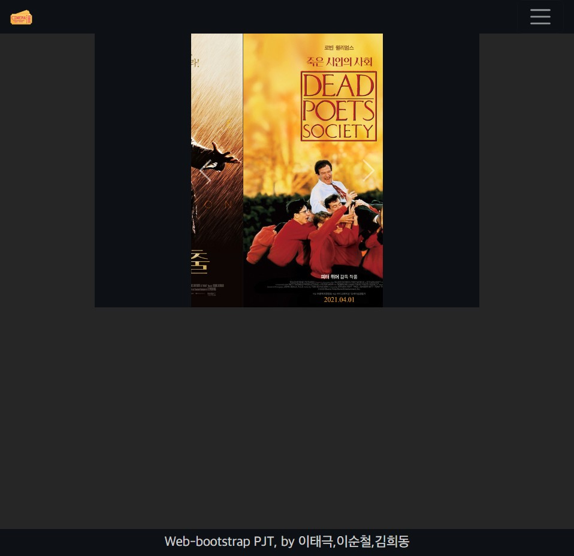
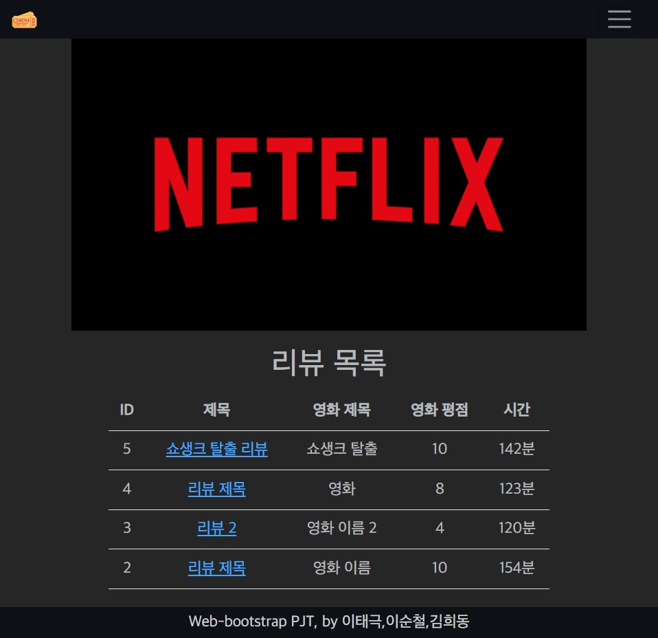
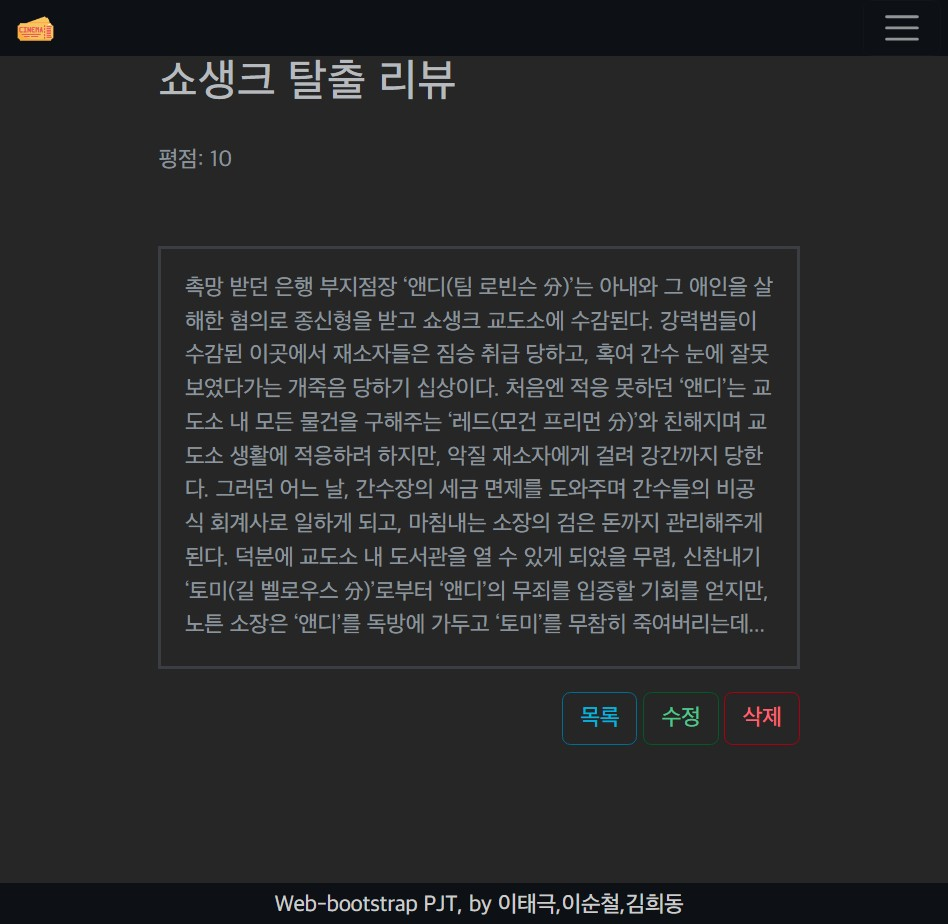
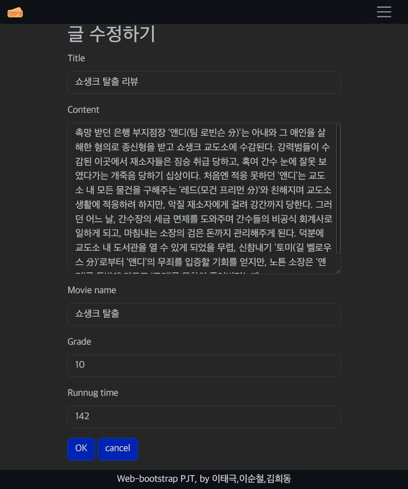
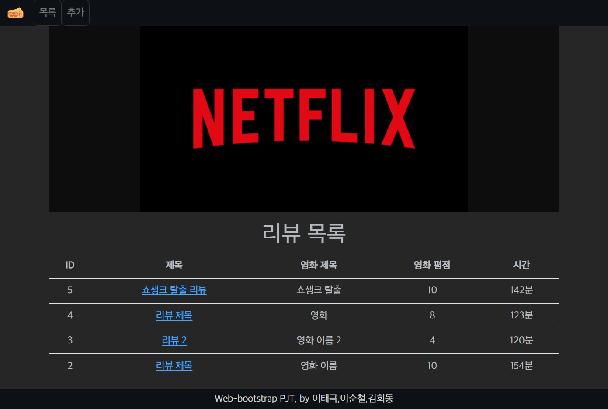

## 시연 화면

### 1. 메인 페이지



### 2. 리뷰 리스트 페이지



### 3. 리뷰 상세 페이지



### 4. 리뷰 수정 페이지



### 5. 반응형 Navbar



## 목표

페어 프로그래밍을 통한 영화 리뷰 커뮤니티 서비스를 개발합니다. 아래 조건을 만족해야합니다.

- ModelForm 활용 CRUD 구현
- Staticfiles 활용 서비스 로고 표시

## 요구 사항

### 모델 Model

모델은 아래 조건을 만족해야합니다.

적절한 필드와 속성을 부여하세요.

- 모델 이름 : Review

- 모델 필드
  
  | 이름         | 역할      | 필드       | 속성                |
  | ---------- | ------- | -------- | ----------------- |
  | title      | 리뷰 제목   |          |                   |
  | content    | 리뷰 내용   |          |                   |
  | movie_name | 영화 이름   |          |                   |
  | grade      | 영화 평점   |          |                   |
  | created_at | 리뷰 생성시간 | DateTime | auto_now_add=True |
  | updated_at | 리뷰 수정시간 | DateTime | auto_now = True   |

### 기능(View), 화면(Template)

**네비게이션바, Bootstrap <nav>**

- 서비스 로고
  
  - Django Staticfiles 활용
  - 클릭 시 메인 페이지로 이동

- 리뷰 목록 버튼
  
  - 클릭 시 목록 페이지로 이동

- 리뷰 작성 버튼
  
  - 클릭 시 작성 페이지로 이동

```html
<!--base.html-->
<nav class="navbar navbar-expand-lg bg-dark navbar-dark p-0 sticky-top">
        <div class="container-fluid">
            <a class="navbar-brand" href=""></a>
            <button class="navbar-toggler" type="button" data-bs-toggle="collapse" data-bs-target="#navbarNav"
                aria-controls="navbarNav" aria-expanded="false" aria-label="Toggle navigation">
                <span class="navbar-toggler-icon"></span>
            </button>
            <div class="collapse navbar-collapse" id="navbarNav">
                <ul class="navbar-nav">
                    <li class="nav-item">
                        <a class="nav-link btn btn-dark" href="">목록</a>
                    </li>
                    <li class="nav-item">
                        <a class="nav-link btn btn-dark" href="">추가</a>
                    </li>
                </ul>
            </div>
        </div>
    </nav>
```

**메인 페이지**

- `GET` http://127.0.0.1:8000/reviews/
- 자유 디자인
- ```html
  <!--reviews/main.html-->
  
  
  
  <div class="bg-dark d-flex justify-content-center">
  <div id="carouselExampleControls" class="carousel slide w-50" data-bs-ride="carousel">
    <div class="carousel-inner">
      <div class="carousel-item active">
        
      </div>
      <div class="carousel-item">
        
      </div>
      <div class="carousel-item">
        
      </div>
    </div>
    <button class="carousel-control-prev" type="button" data-bs-target="#carouselExampleControls" data-bs-slide="prev">
      <span class="carousel-control-prev-icon" aria-hidden="true"></span>
      <span class="visually-hidden">Previous</span>
    </button>
    <button class="carousel-control-next" type="button" data-bs-target="#carouselExampleControls" data-bs-slide="next">
      <span class="carousel-control-next-icon" aria-hidden="true"></span>
      <span class="visually-hidden">Next</span>
    </button>
  </div>
  </div>
  
  ```

**목록 페이지**

- `GET` http://127.0.0.1:8000/reviews/index/

- 리뷰 목록 출력
  
  - 리뷰 제목
  - 영화 이름

- 제목을 클릭하면 해당 리뷰의 정보 페이지로 이동

- ```html
  <!--reviews/index.html-->
  
  
  
  
  
    <link rel="stylesheet" href="">
  
  
  
    <div class="bg-black d-flex justify-content-center mb-3">
      
    </div>
    <h1 class="text text-center">리뷰 목록</h1>
    <table class="table text-center align-middle">
      <thead>
        <th>ID</th>
        <th>제목</th>
        <th>영화 제목</th>
        <th>영화 평점</th>
        <th>시간</th>
      </thead>
      <tbody>
        
          <tr>
            <td>{{review.pk}}</td>
            <td>
              <a href="">{{ review.title }}</td>
              <td>
                {{ review.movie_name }}
              </td>
              <td>
                {{ review.grade }}
              </td>
              <td>
                {{ review.runnug_time }}분
              </td>
            </tr>
          
  
        </tbody>
      </table>
    
  ```

**리뷰 정보 페이지**

- `GET` http://127.0.0.1:8000/reviews/int:pk/
- 해당 리뷰 정보 출력
- 수정 / 삭제 버튼데이터 목록 조회
- ```html
  <!--reviews/detail.html-->
  
  
  
    <div class="top d-flex justify-content-between mb-3">
      <h1 class="">{{ review.title }}</h1>
    </div>
    <div>
      <p class="text-muted">평점:
        {{ review.grade }}</p>
    </div>
    <div class="text">
      <p class="text-muted mt-5 border border-3 p-3">{{ review.content | linebreaksbr }}</p>
    </div>
    <div class="detail-btn text-end">
      <a href="" class="btn btn-outline-info">목록</a>
      <a href="" class="btn btn-outline-success">수정</a>
      <a href="" class="btn btn-outline-danger">삭제</a>
  
    </div>
  
  ```

**리뷰 작성 페이지**

- `GET` http://127.0.0.1:8000/reviews/create/
- 리뷰 작성 폼
- ```html
  <!--reviews/create.html-->
  
  
  
  
  <h1>글쓰기</h1>
  
  <!-- form : 사용자에게 양식을 제공하고 
    값을 받아서(input : name, value) 
    서버에 전송(form : action, method)-->
  <form action="" method="POST">
      
  
      
      {# review_form.as_p #}
      <!-- <label for="title">제목 : </label>
    <input type="text" name="title" id="title" required>
    <label for="content">내용 : </label>
    <textarea name="content" id="content" cols="30" rows="10" required></textarea> -->
      
      
  </form>
  
  ```

**리뷰 수정 페이지**

- `GET` http://127.0.0.1:8000/reviews/int:pk/update/
- 리뷰 수정 폼
- ```html
  
  
  
  
  <h1>글 수정하기</h1>
  
  <form action="" method="POST">
      
      
      
      
  </form>
  
  ```


